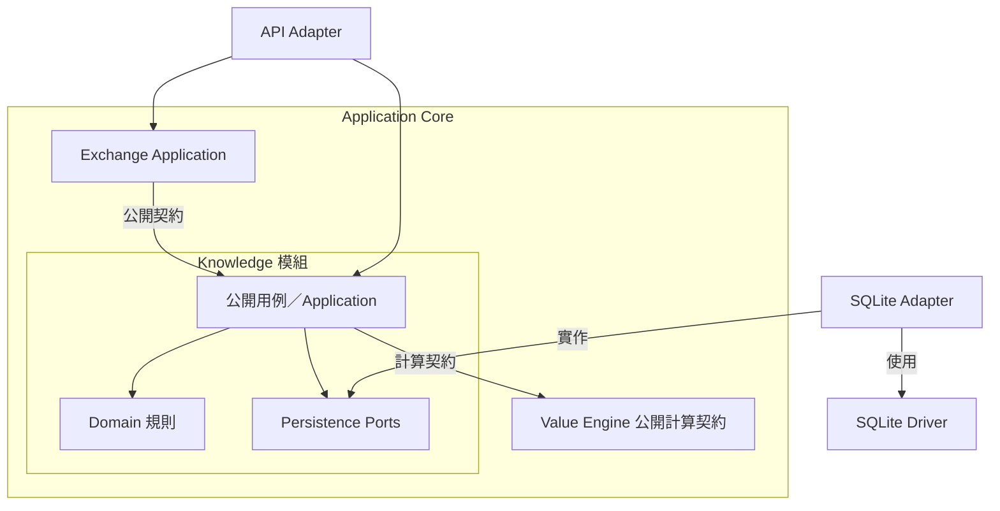
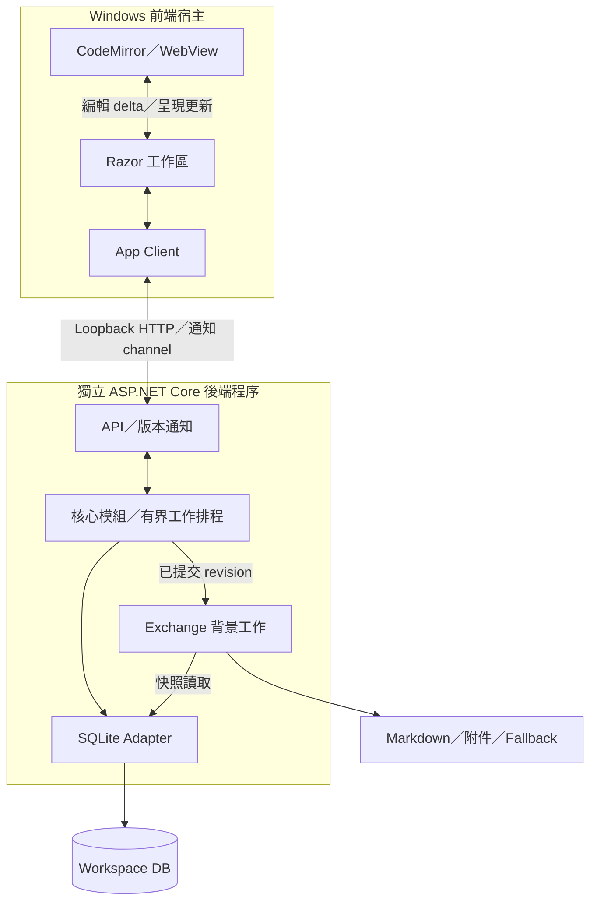
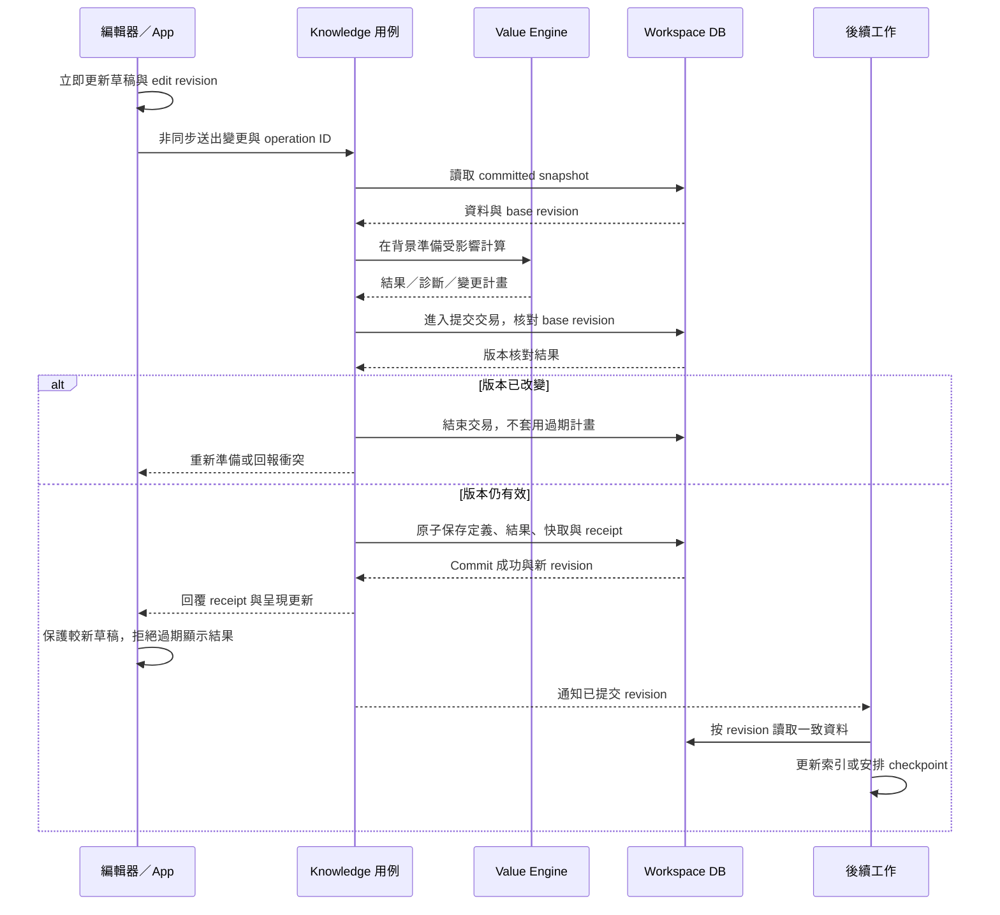

## 圖解的用途與讀法

這是 GraspPortable 自己的架構圖，對應 [產品架構 rc.2](GraspPortable-Architecture-v1.0.0-rc.2.md) 與 [模型決策](Decisions/Architecture-Model-v1.0.1.md)。原文圖只作 Explicit Architecture 的概念參考。

三張圖分別表達 source dependency、執行通訊和提交時序，箭頭含義各自標明。圖中的模組與程序是設計基準，尚未實作；省略部分不能解讀成產品沒有該責任。

## 與參考模型的關係

| 面向 | 參考文章 | 本產品圖解 |
| --- | --- | --- |
| 模組協作 | 在完全解耦的方案中，以事件及 Shared Kernel 避免模組直接引用 | 允許明示的公開契約依賴；需要立即結果的操作可直接呼叫 |
| 事件與一致性 | 討論跨 Component 通知及不同資料儲存配置 | 共享修改集中原子提交，提交成功後才通知後續工作 |
| 讀写模型 | 展示有／無 Command／Query Bus 的形式 | 依用途分工，初期共用本機資料權威；Bus 非必要構件 |
| 程序與排程 | 是通用架構概念，不指定本產品執行配置 | Windows 前端與後端分程序，背景工作有界排程 |
| 外部技術 | UI、DB 等經 adapters 連接核心 | 用已選的 MAUI／Razor、CodeMirror、ASP.NET Core 與 SQLite 映射 |

此表區分真正的取捨與本產品新增的具體配置。原文也提供無 Bus 的形式，因此「不用 Bus」不是對原文原則的推翻。

## 1. 程式碼依賴：以 Knowledge 與 Exchange 協作為例

箭頭指向被依賴者。SQLite Adapter 依賴核心定義的 Port；Knowledge 並不引用 SQLite Adapter。Exchange 對 Knowledge 的公開契約依賴是本方案刻意允許的模組協作。

本圖取代表性模組說明規則，完整模組清單仍以產品架構責任地圖為準。Host 的依賴注入組裝、transport DTO 映射、各模組其他 ports 及最小共享值型別未在此展開。Value Engine 節點表示對該模組公開計算契約的依賴，其內部實作不向 Knowledge 暴露。

API Adapter 是後端入口；本圖不表示 UI 可跨程序直接呼叫後端 Domain。執行通訊見下一圖。

## 2. Windows 執行配置

箭頭表示執行期間的資料／控制流。前端宿主包含 MAUI App 與嵌入式 WebView；圖中不展開 WebView 引擎自身的 OS 程序配置。ASP.NET Core 後端是另外啟動的程序。

按鍵、游標、選取、IME 與 undo 在 editor 本地立即處理；圖中 interop 與 API 不代表每個按鍵都同步等待後端。Razor 負責工作區 UI，App Client 隔離具體 backend transport。

後端內部的邏輯模組共同部署，不逐一變成 HTTP 服務。SQLite 與檔案的箭頭不表示同一 transaction；DB 先提交，Markdown／fallback 後續按固定 revision 產生。通知 channel 的具體協定仍屬實作選擇。

## 3. 共享修改：先一致提交，再通知

箭頭表示時間先後；虛線為回覆或通知。圖中分支是 revision 檢查，不把過期計畫套用到新資料。

Prepare 在背景執行，不長時間占有寫入 transaction。提交的內容包含該次有效共享修改要求的定義、受影響結果、持久引用快取與 receipt；它們共同成功或失敗。圖中的「後續工作」合併表示 Query 索引與 Exchange 工作，不是額外的 domain 模組。

通知版本用於失效判斷；後續工作可取得較新的完整 snapshot，並標示實際 revision。必須處理指定歷史 revision 時，使用已保留的快照資料，不假設 DB 可任意讀取歷史版本。

通知遺失時，依 committed revision／持久 job state 補讀或重建待辦；核心資料正確性不依靠通知必達。取消可在 commit 前中止準備，commit 後則回報已提交。以上與 SQL rollback、UI 草稿 undo 及產品共享 undo 是不同語義。

## 維護

修改責任依賴時更新第 1 圖；修改程序／傳輸時更新第 2 圖；修改一致性或提交順序時更新第 3 圖。與產品架構一同升版及更新入口，保留原參考文章連結作來源。

參考：[Explicit Architecture 原文](https://herbertograca.com/2017/11/16/explicit-architecture-01-ddd-hexagonal-onion-clean-cqrs-how-i-put-it-all-together/)。本文件的圖是本專案設計，未複製原圖。
