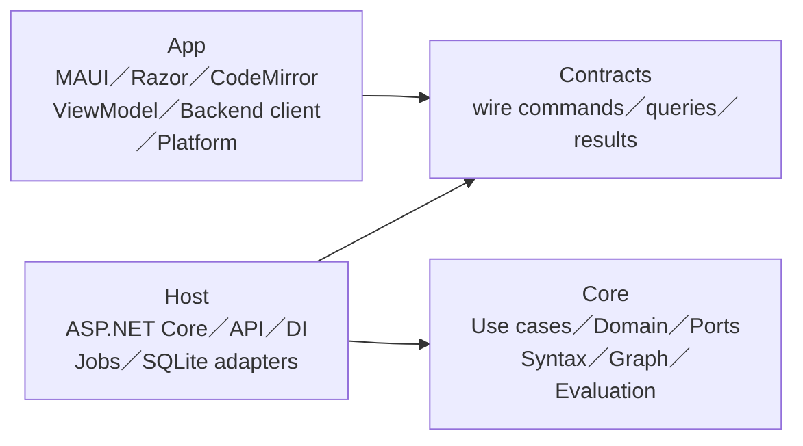
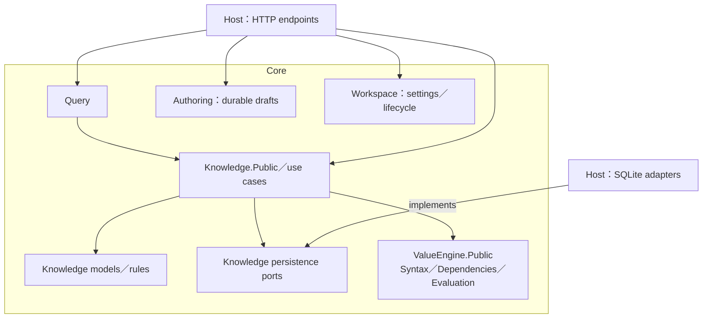
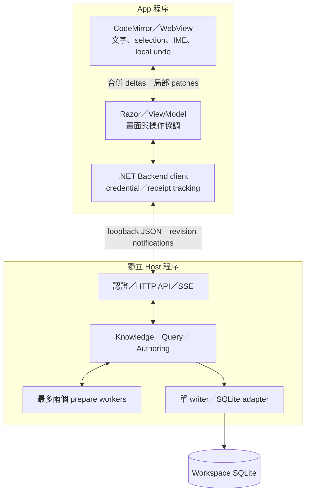
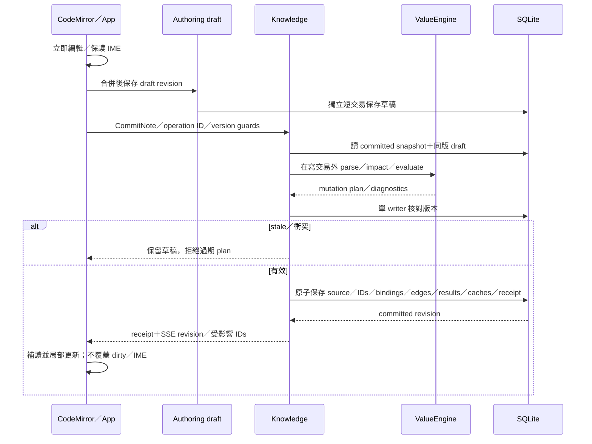

## 圖解的用途

對應 [Architecture rc.3](GraspPortable-Architecture-v1.0.0-rc.3.md)、[Implementation Plan rc.6](Implementation-Plan-v1.0.0-rc.6.md)與[模型決策](Decisions/Architecture-Model-v1.0.2.md)。箭頭意義各圖分開；圖是接受的設計，不是產品驗證證據，動態進度見 [EXECUTION-STATE](../EXECUTION-STATE.md)。

## 1. 四個產品 Projects 的編譯依賴

箭頭指向被依賴者。Core／Contracts 不反向依賴其他產品 project；App 不載入後端 Core／SQLite。

UI／client 位於 App、adapters 位於 Host，責任仍分開。Core owner 的 Public 接面與 wire Contracts 不同；Host 負責映射。目錄以功能組織，未來真正有獨立重用或編譯需要再抽 project。

## 2. Core 模組與外部 adapters

箭頭是 source dependency。Adapter 實作 owner port，Knowledge 不依賴 SQLite driver；ValueEngine 不反向引用 Knowledge。

Exchange／Recovery 是後續 owner，未在 S1 預建空實作；未來透過 Knowledge 公開接面協作。Shared Kernel 只保存確實共同的穩定型別，不變成所有服務集合。

## 3. Windows 執行配置

箭頭為程序間或程序內資料流。WebView 自身 OS 程序不展開。

App 透過受控啟動 pipe 取得 endpoint／credential／版本／workspace identity，不把 credential 交给 JS。按鍵不同步等待 Razor 或 HTTP。SQLite 使用本機 NTFS／WAL／FULL 起始配置；SSE 遺失以版本補讀，不依賴通知必達保住資料。

## 4. 共享修改：先準備，再原子提交

若先回 durable pending，先保存 operation intent；僅排入記憶體不能宣稱已接受。取消只停止可取消的準備，不撤銷已 commit 結果；回應遺失用相同 operation ID 查 receipt。重開從 DB 載入 committed state，另恢復 draft。

## 維護

改 project 引用更新第 1 圖；改 owner／port 更新第 2 圖；改程序／transport 更新第 3 圖；改一致性順序更新第 4 圖。與架構及入口同步升版；實作、必要驗證與使用者接受分開記錄。

Explicit Architecture 採本產品適配：公開接面可直接依賴、共享修改集中提交、通知供可恢復後續工作、Bus 非必要。參考 [原文](https://herbertograca.com/2017/11/16/explicit-architecture-01-ddd-hexagonal-onion-clean-cqrs-how-i-put-it-all-together/)；以上圖為本產品自行繪製。
