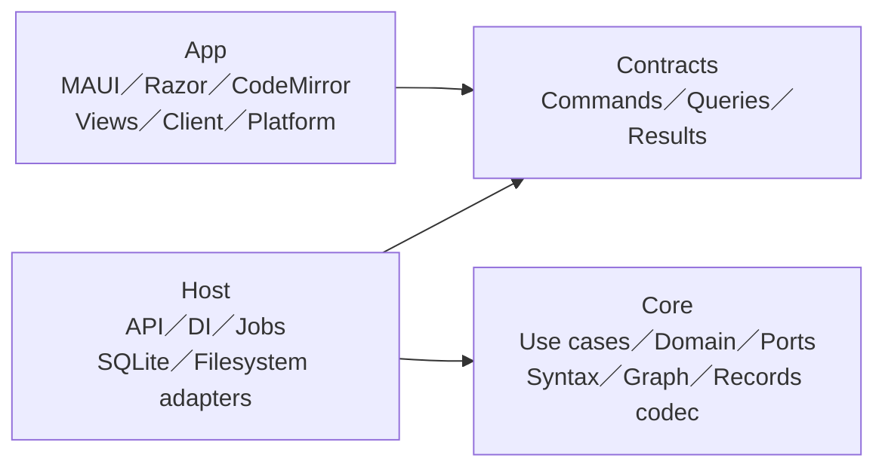
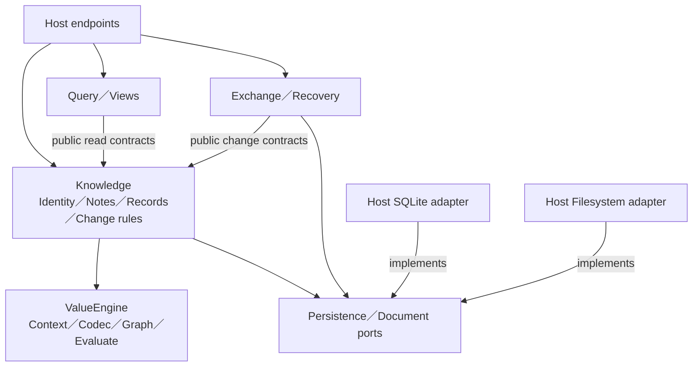
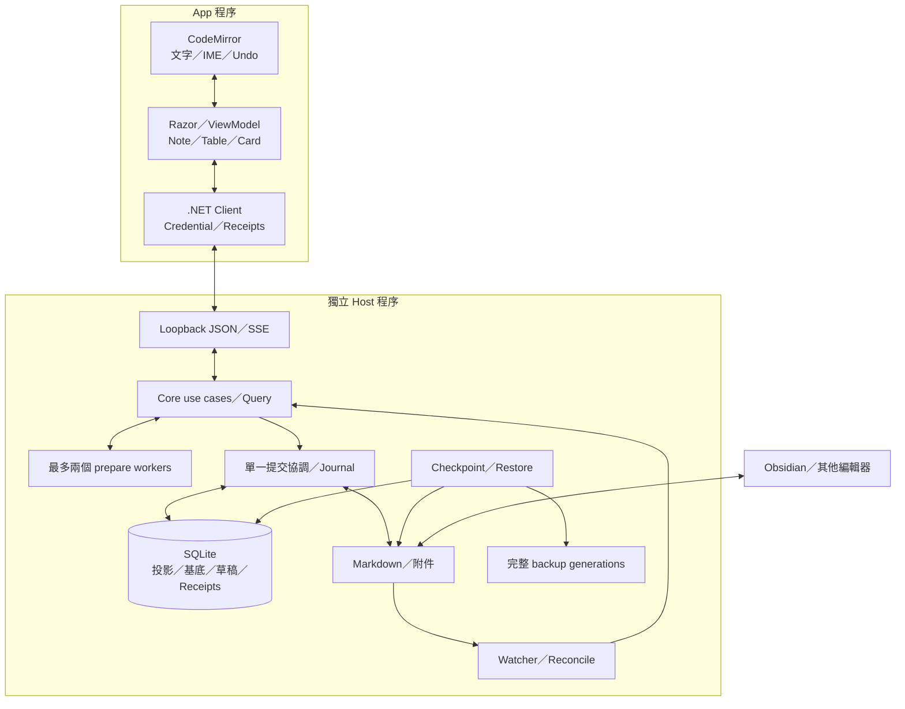
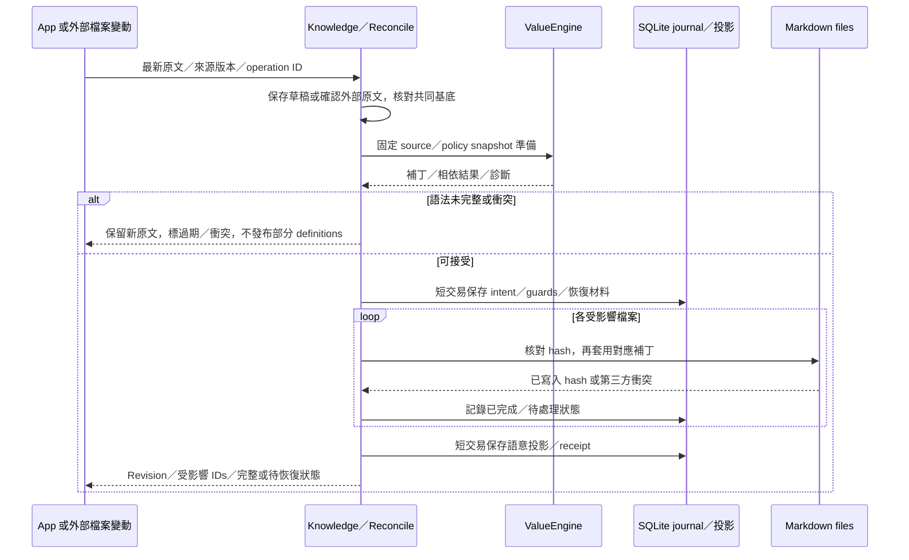
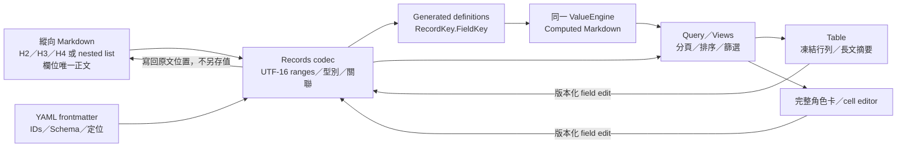

## 圖解用途

對應 [Architecture rc.6](GraspPortable-Architecture-v1.0.0-rc.6.md)、[Plan rc.11](Implementation-Plan-v1.0.0-rc.11.md) 與 [模型決策](Decisions/Architecture-Model-v1.1.1.md)。圖是接受的設計，不是完成證據；動態進度見 [EXECUTION-STATE](../EXECUTION-STATE.md)。Markdown 為已保存原文，SQLite 兼管投影、版本基底及不可丟棄的草稿／journal。

## 1. 四個 Projects 的編譯依賴

箭頭指向被依賴者。App 不引用 Core／Host、不直接開 SQLite。

## 2. 模組與 ports

箭頭表示 source dependency。同 project 模組仍以公開契約及無循環依賴分工；沒有一模組一程序。

Authoring 管 durable draft、Workspace 管設定及生命週期，由 Host 組裝。ValueEngine 僅計算輸入快照；adapter／UI 型別不進入 Core。

## 3. Windows 執行配置

箭頭表示執行資料流。Markdown／附件是正常工作資料；backup 是獨立完整 generation，非第一次可讀輸出。

App 管 Host 啟停；啟動 reconciliation，正常關閉 flush／追蹤操作／補 checkpoint，再結束 Host。前台輸入不等 HTTP，credential 不交給 JS。Writer 鎖限制 Grasp Host，不阻止其他編輯器，因此仍核對外部 hash。

## 4. 共享更新與跨檔恢復

多檔不承諾 ACID。中斷後用 journal、來源 hash 與 receipt 判斷續作；第三方新版本不覆寫。原文保存、語意接受及全部回寫完成分開顯示。回覆遺失查同 operation receipt；取消不撤銷已接受結果。UI 補讀後局部更新，保留 dirty／IME。

## 5. Records 的單一來源與多種呈現

自動屬性與手寫 bindings 共用名稱及相依規則；求值輸出不遞迴解析。Relation 按 record ID，UI 焦點按 record／field ID，不依 row index。轉換後 headings 不用 H1，保留首次原文及層級 mapping；unknown／不明定位停止回寫。

## 維護

改 project dependency 更新第 1 圖；改 owner／ports 更新第 2 圖；改程序或資料角色更新第 3 圖；改 journal／交易順序更新第 4 圖；改 Records source／projection 更新第 5 圖。同步架構、計畫與入口版本，實作／驗證／使用者接受分開記錄。
