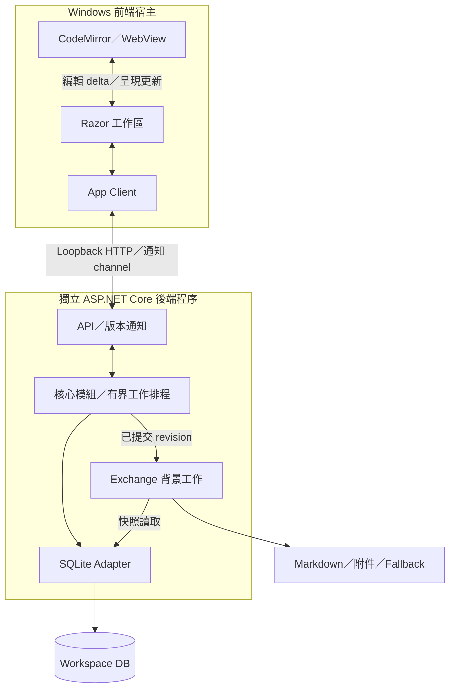

## 先讀這裡

這份架構將 [Seed](../Project_Seed/README.md) 的完整產品方向放入已選的 [Explicit Architecture 模型](Decisions/Architecture-Model-v1.0.2.md)。S1 實作已接受的完整 Windows 筆記流程；完整產品責任仍保留在這份架構中。

整體採用「功能模組 + 模組內部分層 + Ports／Adapters」。Windows App 負責即時互動，本機後端負責資料規則、計算、保存與交換。模組透過明確契約協作，共享修改集中提交，較慢的工作有獨立排程。

最重要的成果是：能找出一項功能歸誰、修改影響何處、哪裡可替換，以及哪個執行路徑可能拖慢 UI。此文件是工程基準；實作與效能／GUI 的動態驗證結果以 EXECUTION-STATE 為準。

[新版架構圖解](GraspPortable-Architecture-Diagrams-v1.1.0.md) 分開呈現程式碼依賴、Windows 執行配置與共享提交時序；原參考圖不作本專案的現行架構圖。

## 1. 產品責任地圖

| 模組 | 功能與持有資料 | 公開接面／主要依賴 |
| --- | --- | --- |
| Workspace | 建立／開啟 workspace、設定、資料版本與生命週期；管理實體 workspace 的存取狀態 | Open、Close、Settings、RecoveryStatus；使用 persistence／platform ports |
| Authoring | Markdown 編輯、Live Preview／Reading、IME、游標、undo、局部操作與導航；持有互動狀態及帶版本的草稿 | EditorSession、DraftChange、Navigate、ApplyEdit；呼叫 Knowledge／Query 公開契約 |
| Knowledge | Note、identity、binding definition、reference occurrence、records、來源對照及共享變更規則；管理 committed revision 和持久快取的一致性 | ReadSnapshot、PrepareChange、CommitChange、ChangeReceipt；呼叫 Value Engine 與 persistence ports |
| Value Engine | Binding 解析、診斷、composition、依賴圖及受影響計算；持有可重建的索引／計算快取 | Parse、AnalyzeImpact、Evaluate；輸入帶版本快照，輸出結果與診斷 |
| Query／Views | 搜尋、階層瀏覽、definition／references、structured-data views；持有可重建的讀取投影 | QueryPage、Locate、ReadView；依 Knowledge 的公開讀取契約及自有 query ports |
| Exchange／Recovery | 確定性匯入、匯出分組策略、外部提案審查、Markdown／附件輸出、fallback 及還原；持有策略、輸出 manifest 與工作狀態 | PreviewImport、ApplyImport、Export、Checkpoint、Restore；讀 Knowledge 快照，經其修改接面套用知識變更 |
| Cross-device Continuity | 裝置間版本、變更交換、衝突辨識及 provider 接面；持有裝置同步進度 | PackageChanges、ReviewIncoming、ApplyIncoming；使用 Knowledge／Exchange 公開契約 |
| Programming Integration | PC 上真正程式的存取與執行接面；持有執行工作狀態 | VersionedKnowledgeAPI、RunStatus；以同一知識接面查詢／修改 |

表中是邏輯模組，不是一模組一程序。Knowledge 集中擁有共享知識的一致性規則，內部仍按 Notes／Identity／Bindings／References／Records 分區；Value Engine 與 Exchange 不各自建立競爭的知識權威。

Platform、SQLite、HTTP、編輯器與雲端 provider adapters 是上述模組的外部實作。工作排程是 runtime 服務；這些技術責任不冒充產品功能模組。

## 2. 核心內部的分層與依賴

- Application：編排一次使用者操作、讀取版本、權限／來源政策、取消、提交與結果回覆。
- Domain：identity、binding／reference 意義、共享變更規則、composition 及資料完整性。資料結構与純函式可以配合物件使用。
- Ports：描述核心需要的持久化、查詢、檔案、平台及外部服務能力。
- Adapters：處理 framework、DB、編輯器或 OS 的具體 API。Host 是組装與啟動位置。

Application 可以依賴 Domain 與 Ports；Adapters 依賴對應契約；Domain 不依賴 Host／UI／HTTP／SQLite。程式碼依賴與實際呼叫流程分開理解。

模組間公開接面放在 owner 的 Public 區域（與程序間 wire Contracts 分開）；消費者對契約的依賴須列明。Shared Kernel 僅保留跨模組確實相同的穩定型別，不放所有模組服務。跨模組依賴保持無循環；Application 協調需要多模組參與的 use case。

讀取也經明確契約。Query 的 SQLite adapter 可使用 Knowledge 公開且可版本化的 read schema／view，不能任意依賴私有表結構。優化查詢可直接投影成 DTO，避免為了畫面資料載入完整 domain object graph。

## 3. Windows 執行配置

圖示是執行通訊，並非 source dependency。前端宿主包含 MAUI App 及 WebView 引擎，圖中不展開引擎自身的 OS 程序配置；本機後端是獨立程序，後端內的功能模組以公開契約直接協作。

MAUI App 啟動並管理本機後端。API 僅綁 loopback，使用每次啟動建立的 session credential，核對後端版本與 workspace 身分；其他本機網頁不能僅因可連 loopback 就取得修改權。結束時等待已接受提交收尾，長工作按狀態取消或恢復。

Blazor Hybrid 的 Razor 元件在 App 的 .NET 環境執行，透過本機 interop 呈現於 WebView；ASP.NET Core 後端服務資料與操作，不負責逐次輸入的 UI rendering。編輯器 JS 管理立即輸入、游標、選取、IME 及 undo，Razor 管理周邊 UI。

App Client 是 UI 的 backend port。Windows 用本機 HTTP command／query adapter；版本通知以可替換的通知 channel 傳送。UI 不透過該 API 同步等待每個按鍵。S1 採 HTTP JSON commands／queries 與 SSE revision 通知；重連有缺口就補讀 snapshot。

## 4. 編輯、計算與保存的一致性

一次共享變更採下列流程：

1. UI 立即更新草稿與 local edit revision；將可合併的 source delta 非同步送往後端。草稿可獨立保存以便恢復，但不冒充已提交的共享值。
2. Knowledge 取得帶 base revision 的一致快照；Value Engine 在受限工作排程中解析變更、分析影響並計算結果。
3. Prepare 產生明確的 mutation plan：新 source／binding、identity／reference 變動、受影響結果、快取與診斷。這個階段不發布半套共享狀態。
4. 進入提交通道時核對 base revision。版本仍有效才在同一 DB transaction 套用完整共享變更與 receipt；版本已變時重新準備或回報衝突。
5. DB commit 成功後發布新 revision。UI 按文件與 revision 套用結果；若有較新草稿，保留草稿並重算／對照，不能用舊結果覆蓋它。
6. Query 索引、Markdown checkpoint 等可恢復的後續工作收到已提交通知後進行。正常 DB 提交不等待整棵 Markdown 文件樹發布。

Shared commit 的一致性包含已承諾的定義、受影響的 resolved values 及持久引用快取。暫時的 draft preview 另有明示狀態。Domain missing／cycle 是可描述的資料狀態；不能以空值假成功。

Prepare 期間不長時間持有 SQLite 寫入 transaction。初期以 workspace revision 做保守並行檢查；若後續事實證明不相關修改造成大量重算，可在保留一致性的條件下細化為 read-set／entity revision。

每個已接受的修改有 operation ID；receipt 與變更一起提交。回覆遺失時查詢同一 receipt 或以同 ID 重試，避免重複套用。取消在 commit 前可中止；commit 完成後回覆已提交狀態，不把取消當作撤销。共享 undo 的產品語義依相應契約確認，不由 draft undo 自動推導。

一次邏輯變更涉及 Exchange 自有策略和 Knowledge 資料時，由 Application 協調共同 transaction／revision；各 owner 產生自己負責的變動。大型還原先進隔離 staging workspace，驗證完整性後再切換，避免部分還原冒充成功。

## 5. 效能與工作排程

架構必須服務 Seed 的三項要求：Excel 類型高互動依賴關係、真實資料下 UI 流暢、未來成長效能餘裕。分程序隔離可降低背景 GC／排程對 App 的直接影響，但 CPU、記憶體與 I/O 仍共享，需要以下安排：

| 工作 | 排程與資料策略 | 過載／過期處理 |
| --- | --- | --- |
| 即時編輯呈現 | 編輯器本地處理；只更新受影響區域與可見內容 | 合併 UI 通知，不重建整個編輯器狀態 |
| 解析與重算 | 後端有界 CPU worker；增量解析／依賴失效；查詢與工作快照共享不可變資料 | 同一草稿的新版本取代舊工作；檢查取消與版本；已接受 durable command 不靜默丟棄 |
| 查詢與導航 | 分頁、索引、受限 read connections；大型結果分批返回 | 取消舊查詢，避免一次回傳整庫／整圖 |
| 持久提交 | 每 workspace 一個提交通道；批量寫入受影響內容 | 有界等待與可見狀態；長 prepare 不占寫鎖 |
| 匯出／checkpoint／重建 | 低優先工作；以 committed snapshot 分批處理及 I/O 限流 | 可取消／續作，保留最後成功產物；不阻塞正常輸入 |

表內是邏輯與執行安排；S1 起始為每 workspace 最多兩個 CPU prepare workers、單 writer；connection 與 batch 依代表 workload 調整。有 `async` 或命名為不同 lane 本身不構成執行隔離。

Graph 的單一 node 不等於單一網路請求或 domain event。批次傳入受影響資料、批次回傳 delta；限制快取記憶體與展開結果大小的資源使用。遇到極端展開，提供明確工作／資源狀態，不靜默截斷資料。

效能觀測聚焦 input-to-visible、input-to-committed、查詢延遲、佇列等待、記憶體峰值及匯出 I/O。端到端成本涵蓋 JS／.NET interop、序列化、HTTP、解析、計算、保存及渲染。P0／M4 已指出 graph 很快仍可能整體很慢；既有測量不轉成新產品通過證明。

## 6. 儲存、交換與故障恢復

SQLite 保持本機 runtime authority，各模組透過其 persistence ports 存取。一次提交只有一個 writer；讀者取得完整 committed snapshot。對相容本機磁碟可採 WAL；其他檔案系統須依 locking 與恢復條件驗證，不能把開啟中的 DB 檔直接交給一般雲端檔案同步。

Markdown fallback 與 SQLite WAL checkpoint 是不同責任。前者是產品的可讀、可還原輸出；後者是 DB 日誌管理，不取代 fallback。

Exchange 使用固定 revision 的 export snapshot，輸出到新 generation，完成 manifest／附件／完整性檢查後再發布完成標記。中斷時讀取者仍能找到前一次完整 generation。檔案系統無法提供預期 atomic rename 時，改用可恢復的 generation／完成標記策略並驗證。

重啟以 committed DB 恢復，Query／graph 等衍生索引按版本補建；UI 取得最後已存草稿及 committed revision。需要持久執行的後續工作保存 job state；非持久通知丟失時可依 revision／manifest 重建待辦，不靠 event delivery 保住資料正確性。

Schema migration 在 workspace 打開前檢查版本，保留可恢復副本並記錄結果；破壞性資料語義改變仍需使用者裁定。匯入及外部策略提案保留來源／基底版本、preview、validation 與 explicit apply。

## 7. 跨平台與較後面的能力

核心使用 .NET 可攜契約，不依賴 Windows 路徑、檔案總管、WebView API 或服務程序模型。平台檔案、分享、生命週期及後端啟動由 adapter 處理。

Windows 本機後端分程序是當前部署選擇。Mobile 透過 App Client port 對接平台容許的本機 runtime；可評估同程序載入核心並以背景工作執行，不能直接假設 iOS 可沿用 Windows 的子程序。共用程式的實際程度由平台建置與操作驗證確認。

Cross-device Continuity 以版本化資料交換及一致套用契約連接核心，成熟雲端 provider 負責 bytes 傳輸。同步格式、排程與衝突呈現仍待產品流程確認；因此先保留責任與接面，尚不固定 provider 或自動覆寫政策。

Programming Integration 透過同一查詢／修改契約接觸知識。真正使用者程式採外部執行邊界；異常與 timeout 不應拖垮 App Runtime。語言、權限、隔離機制與工具體驗在該能力的實作計畫細化。

## 8. Solution／project 配置基準

| Product project | 類型與責任 | 允許的 project 依賴 |
| --- | --- | --- |
| GraspPortable.App | MAUI Blazor Hybrid executable；Razor、editor assets、畫面狀態／ViewModel、client、Windows 啟動／平台 | Contracts |
| GraspPortable.Host | ASP.NET Core executable；API、排程、DI、SQLite／檔案 adapters、後端生命週期 | Core、Contracts |
| GraspPortable.Core | Class Library；功能 use cases／domain／ports／parser／graph／evaluation | 無 |
| GraspPortable.Contracts | Class Library；程序間 commands／queries／receipts／notifications | 無 |

七專案方案收斂為四個，避免首輪 UI／Client／Infrastructure 跨 assembly 分散維護。UI 與 backend client 邏輯仍各自有接面，只是位於 App；外部 adapters 在 Host，核心 ports 保留 Core。後端由 Host 啟動，Class Libraries 不承擔 executable。

Host 將 wire DTO 映射 Core 型別。Core 與 Contracts 均不依賴其他產品 project；Contracts 不含 ORM entity／服務實作。App 不引用 Core／Host、不直接開 DB。

按功能建立淺目錄，僅在需要時分 Public／Model／Ports。Core 跨 owner 限制：Knowledge → ValueEngine.Public、Query → Knowledge.Public、後期 Exchange → Knowledge.Public；ValueEngine 不反向讀取 Knowledge。所有跨模組依賴保持無循環。同 assembly 的 namespace 不是編譯隔離，使用少量有意義的依賴檢查；實際獨立重用／build／test 需求出現時再抽 project。

App 同一功能的 Razor、樣式、ViewModel、Editor TypeScript／Interop 鄰近放置。CodeMirror 持有高頻文字、selection、IME／local history；ViewModel 協調畫面狀態，Backend client 經 port 提供操作。Renderer dispatcher 套用狀態；component dispose 不取消已接受提交的結果追蹤。目錄可按 use case 細化，不预建空的 mobile／後期 modules。

## 9. 規劃狀態與實作入口

| 模組／責任 | Importance | Environment | Agent | 計畫階段 |
| --- | --- | --- | --- | --- |
| Workspace、Authoring、Knowledge、ValueEngine、最小 Query | Trunk | 邏輯 Cloud-capable；Windows／IME／SQLite 整合 Local-required | High-capability，模型／effort 預設沿用 | S0–S1 |
| Exchange／Recovery | Trunk，分期 | 邏輯 Cloud-capable；副本／filesystem／復原 Local-required | High-capability | S2–S3 |
| Records／進階 Views | Non-trunk，相對 S1 | 邏輯 Cloud-capable；UX Local-required | High-capability | S4 |
| Cross-device Continuity／Programming | Non-trunk，相對 S1 | 契約 Cloud-capable；平台 Local-required | High-capability | S5 |

Status 是動態維度，集中於 EXECUTION-STATE，不在靜態架構重複保存過時完成狀態。四個 source 入口為 `src/GraspPortable.App`、`src/GraspPortable.Host`、`src/GraspPortable.Core`、`src/GraspPortable.Contracts`；tests 隨實際高風險契約建立，具體 build／操作入口由交付文件記錄。

原文 rename 核心、共享 literal 修改、一般段落 Live Preview 均在 S1。專用 rename UI、composition 專用編輯器與共享語意 undo 延後；延後 UI 不移除已承諾的身分與共享提交能力。

## 10. 分期處理的未定事項

- S1 已接受 syntax profile、Windows／Portable 優先及暫定效能門檻，見現行 Implementation Plan；沒有需要重問才可開始的產品決策。
- 最低 PC、真實資料／成長尺度及跨裝置能力依後期實測，不能由目前高階 PC 推論。
- Fallback 落後窗口／保留政策、外部來源定案權限、跨裝置衝突及 Programming 權限在對應阶段确认，不阻擋 S1。
- 本機完整端到端成本由 Windows 可操作流程驗證；不由框架名稱或架構圖推定達標。

## 11. 工程依據與證據界線

- [模型決策](Decisions/Architecture-Model-v1.0.2.md) 記錄 Explicit Architecture 的採用範圍與取捨。
- [Microsoft：Blazor Hybrid](https://learn.microsoft.com/en-us/aspnet/core/blazor/hybrid/?view=aspnetcore-10.0) 說明 Razor 在 native .NET 執行並經本機 interop 呈現；此架構據此區分 UI 宿主與資料後端。
- [SQLite isolation](https://www.sqlite.org/isolation.html) 說明單一 writer 與 committed snapshot；[WAL](https://www.sqlite.org/wal.html) 說明讀寫併行及檔案系統限制。本文排程與攜帶方式是本專案設計，並非 SQLite 自動提供完整產品恢復。
- [Prototype reference](../Reference/README.md) 保留 P0／M4 workload、成本歸因與未達 UX 目標的事實。

本文件不作產品驗證證據；build、GUI、效能與故障測試的實際結果由 EXECUTION-STATE 及當次驗證紀錄維護。
